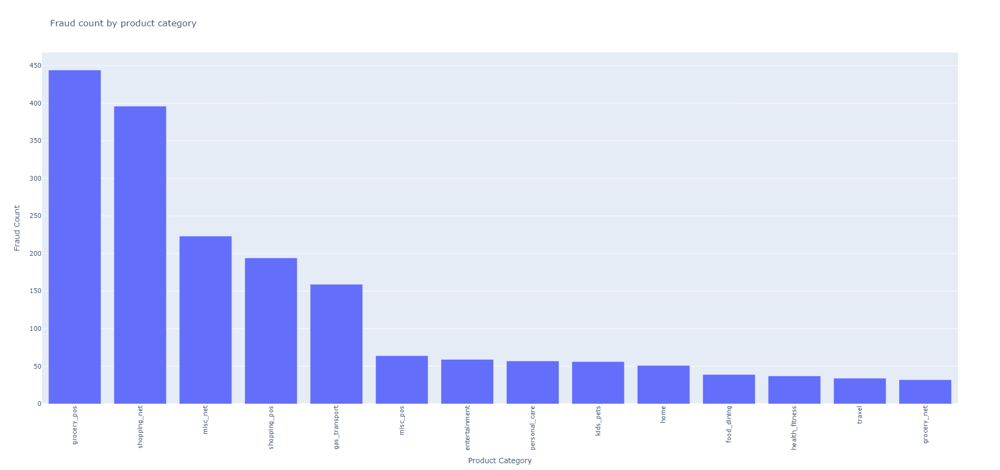

# fraudulent-transaction-detector

# Overview
The Credit Card Fraud Checker is a machine learning project that detects fraudulent credit card transactions. It uses a Random Forest Classifier to classify transactions based on patterns in the data.

# Features:
Data Preprocessing: Cleaning and transforming raw transaction data for machine learning.
Exploratory Data Analysis (EDA): Visualizing trends of fraudulent transactions across categories and states.
Random Forest Model: Training a Random Forest classifier with predefined parameters or tuning it via GridSearchCV.
Model Evaluation: Performance analysis using accuracy, confusion matrix, and classification report.

#Prerequisites
Ensure you have Python 3.9+ installed and the following libraries:

pandas
plotly
scikit-learn
numpy
matplotlib

run ```"$pip install -r requirements.txt"``` to install all libraries

# Data Cleaning and Transformation
Cleaning the 'is_fraud' Column:
Converts is_fraud to numeric values (0 for non-fraudulent, 1 for fraudulent) to facilitate accurate analysis and modeling.

Fraud Counts by Product Category:
Aggregates fraudulent transactions by product category to identify which categories are most prone to fraud.

Fraud Counts by State:
Analyzes fraudulent transactions by state to highlight regions with higher fraud rates.

Unique Transaction Count by Category:
Counts unique transactions per category to understand transaction volume and identify categories with high transaction activity.

Data Transformation:
Extracts features like age and transaction_hour from date columns to enhance model input and analyze patterns in fraudulent activities.

# Usage

The main.py script performs the following key tasks: data cleaning, visualizations, and model training. It also allows for hyperparameter tuning using GridSearchCV, which is commented out by default but can be uncommented if needed.

Running the Project
Run the script:
```python src/main.py```

PS make sure to use required python version (3.9+) including all required libraries

# Data Preprocessing and Visualizations:

The script first cleans the dataset and generates various visualizations. These visualizations help in understanding the distribution of fraudulent transactions and other insights from the data.
Example Visualizations:
Fraud Count by Product Category: The following bar chart shows the count of fraudulent transactions per product category:

Figure 1: Number of fraudulent transactions by product category.

Fraud Count by State: This bar chart illustrates the number of fraudulent transactions by state. It also shows total transactions in each state, which helps in identifying states with higher fraud rates.

Figure 2: Number of fraudulent transactions and total transactions by state.

Age Distribution of Fraud Victims: This histogram displays the age distribution of victims of fraudulent transactions:

Figure 3: Age distribution of individuals affected by fraudulent transactions.

# Hyperparameter Tuning
In the random_forest() function within main.py, hyperparameter tuning via GridSearchCV is available but commented out by default to reduce computation time during normal runs.

To enable hyperparameter tuning, uncomment the following lines in random_forest():
``` 
# param_grid = {
#     'n_estimators': [50, 100, 200],
#     'max_depth': [None, 10, 20, 30],
#     'min_samples_split': [2, 5, 10],
#     'min_samples_leaf': [1, 2, 4],
#     'bootstrap': [True, False]
# }

# grid_search = GridSearchCV(estimator=rf, param_grid=param_grid, cv=5, n_jobs=-1, verbose=2)

# uncomment block below to run hyperparameter tuning
# grid_search.fit(X_train, y_train)
# print(f"Best Parameters: {grid_search.best_params_}")
# print(f"Best Score: {grid_search.best_score_}")
# best_params = grid_search.best_params_
```
This will allow the Random Forest model to find the best parameters based on cross-validation.

# Example Results
After running the script, the model will output various performance metrics and visualizations:

Confusion Matrix: This matrix helps to understand how well the model distinguishes between fraudulent and non-fraudulent transactions:
``` 
Confusion Matrix: [[2527   14]
                   [  36  313]]
```
Figure 4: Confusion matrix showing true positive, true negative, false positive, and false negative counts.

Classification Report: The classification report provides precision, recall, F1-score, and support for each class. Here’s an example output:
```
Classification Report:               precision    recall  f1-score      support
0              0.985954  0.994490  0.990204  2541.000000
1              0.957187  0.896848  0.926036   349.000000
accuracy       0.982699  0.982699  0.982699     0.982699
macro avg      0.971570  0.945669  0.958120  2890.000000
weighted avg   0.982480  0.982699  0.982455  2890.000000
```
Figure 5: Classification report including precision, recall, and F1-score.

# Results
The project produces several key insights and metrics:

Accuracy: Reflects how accurately the model predicts fraudulent transactions.
Confusion Matrix: Details the number of correctly and incorrectly classified transactions.
Classification Report: Provides a detailed performance assessment, including precision, recall, and F1-score for both classes.
Visual Examples
Fraud Count by Category: Helps in understanding which product categories are more prone to fraud.
Fraud Count by State: Identifies regions with higher fraud rates, useful for targeting fraud prevention efforts.
Age Distribution: Provides insights into the demographic distribution of fraud victims.
